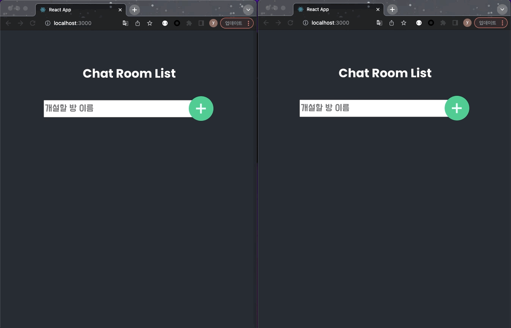
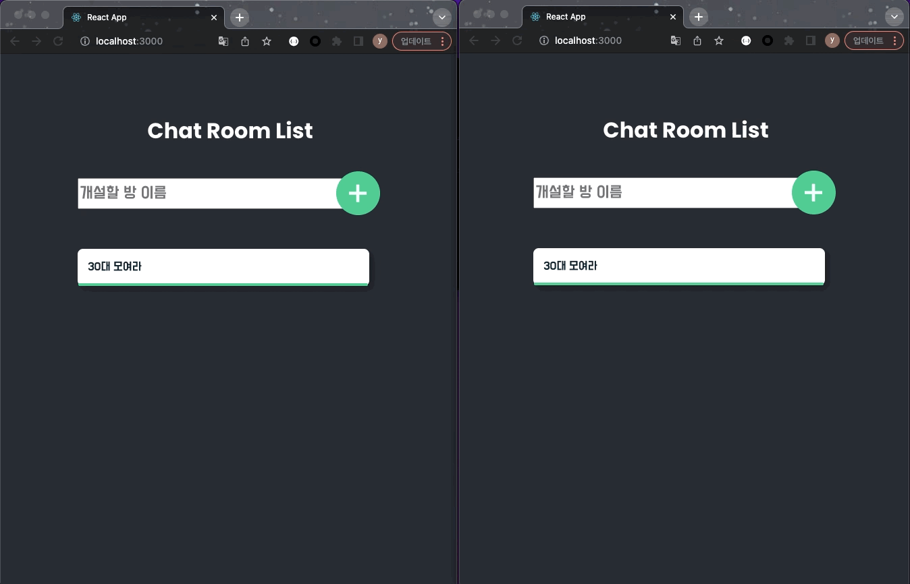

# Redis를 이용한 WebChat 만들기

Followed by [spring-websocket-chatting](https://daddyprogrammer.org/post/4077/spring-websocket-chatting/) by [Daddy Programmer](https://daddyprogrammer.org/)

## Demo

### 방 만들기



### 채팅하기



## Run

### Back-End : Run WebchatApplication.java

Runs the app in the development mode.\
Use [http://localhost:8080](http://localhost:8080) to communicate with web socket.

### FrontEnd : `npm start`

Runs the app in the development mode.\
Open [http://localhost:3000](http://localhost:3000) to view it in your browser.

## Redis

### properties 설정

```yml
spring:
  redis:
    host: localhost # redis 서버 호스트
    port: 6379 # redis 서버 포트
    database: 0 # 커넥션 팩토리에 사용되는 데이터베이스 인덱스
    password: # redis 서버 로그인 패스워드
    timeout: 0 # 커넥션 타임아웃 ( ms )
    pool:
      max-active: 8 # pool에 할당될 수 있는 커넥션 최대수 ( 음수로 하면 무제한 )
      max-idle: 8 # pool의 "idle" 커넥션 최대수 ( 음수로 하면 무제한 )
      min-idle: 0 # pool에서 관리하는 idle 커넥션의 최소 개수 ( 양수일때만 유효 )
      max-wait: -1 # pool이 부족할 때, 커넥션 할당 차단 최대 대기 시간 ( ms, 음수로 하면 무제한)
    sentinel:
      master: # redis 서버 이름
      nodes: # host: 포트 쌍 목록 ( 콤마로 구분 )
```

### Local 환경에서 Embedded Redis 설정

local 환경에서는 별도의 Redis 서버없이, 서버가 켜짐과 동시에 서버에서 내장 Redis 서버도 실행하도록 해준다

```java
import org.springframework.beans.factory.annotation.Value;
import org.springframework.context.annotation.Configuration;
import org.springframework.context.annotation.Profile;
import redis.embedded.RedisServer;

import javax.annotation.PostConstruct;
import javax.annotation.PreDestroy;

@Profile("local")
@Configuration
public class EmbeddedRedisConfig {

    @Value("${spring.redis.port}")
    private int redisPort;

    private RedisServer redisServer;

    @PostConstruct
    public void redisServer() {
        redisServer = new RedisServer(redisPort);
        redisServer.start();
    }

    @PreDestroy
    public void stopRedis() {
        if (redisServer != null) {
            redisServer.stop();
        }
    }
}
```

### Redis Config 설정

```java
@Configuration
public class RedisConfig {

    /**
     * redis pub/sub 메시지를 처리하는 listener 설정
     */
    @Bean
    public RedisMessageListenerContainer redisMessageListener(RedisConnectionFactory connectionFactory) {
        RedisMessageListenerContainer container = new RedisMessageListenerContainer();
        container.setConnectionFactory(connectionFactory);
        return container;
    }

    /**
     * 어플리케이션에서 사용할 redisTemplate 설정
     */
    @Bean
    public RedisTemplate<String, Object> redisTemplate(RedisConnectionFactory connectionFactory) {
        RedisTemplate<String, Object> redisTemplate = new RedisTemplate<>();
        redisTemplate.setConnectionFactory(connectionFactory);
        redisTemplate.setKeySerializer(new StringRedisSerializer());
        redisTemplate.setValueSerializer(new Jackson2JsonRedisSerializer<>(String.class));
        return redisTemplate;
    }
}
```

### RedisConnctionFactory

- RedisConnectionFactory를 지원하는 라이브러리는 jedis와 lettuce가 있다.
- 단, jedis는 thread-safe하지 않기때문에 jedis-pool을 사용해야한다. 그렇기에 lettuce를 더 많이 사용한다.
- lettuce는 비동기 이벤트 프레임워크인 Netty를 기반으로 만들어진 Redis 클라이언트이다.

#### RedisMessageListenerContainer 이내부적으로 ConnectionFactory를 사용하는 법

```java
connection = connectionFactory.getConnection();
if (connection.isSubscribed()) {
 throw new IllegalStateException("Retrieved connection is already subscribed; aborting listening");
}

boolean asyncConnection = ConnectionUtils.isAsync(connectionFactory);

// NB: sync drivers' Xsubscribe calls block, so we notify the RDMLC before performing the actualsubscription.
if (!asyncConnection) {
 synchronized (monitor) {
  monitor.notify();
 }
}

SubscriptionPresentCondition subscriptionPresent = eventuallyPerformSubscription();

if (asyncConnection) {
 SpinBarrier.waitFor(subscriptionPresent, getMaxSubscriptionRegistrationWaitingTime());
 synchronized (monitor) {
  monitor.notify();
 }
}
```

### Redis 를 이용하여 Pub/Sub 기능 구현하기

#### Publisher 구현하기

RedisTemplate 의 convertAndSend 메서드를 통해 메시지를 발행한다.
이때 Redis 스프링 라이브러리에서 구현된 ChannelTopic와 개인적으로 구현한 ChatMessage를 인자로 주면,
해당 토픽에 메세지가 발행된다.

```java
@RequiredArgsConstructor
@Service
public class RedisPublisher {
    private final RedisTemplate<String, Object> redisTemplate;

    public void publish(ChannelTopic topic, ChatMessage message) {
        redisTemplate.convertAndSend(topic.getTopic(), message);
    }
}
```

#### Subscriber 구현하기

Publisher는 별도의 인터페이스 없이 구현한 것에 반해, Subscriber는 Redis 스프링 라이브러리에 있는 MessageListener 인터페이스를 구현해야한다.
MessageListener에 있는 onMessage는 Publisher에서 발행시 지정한 토픽일 경우 발현된다.
onMessage에 인자로 오는 Message는 Redis에 저장된 날것의 String값이므로, RedisTemplate을 이용하여 읽을 수 있는 객체 형태 (ChatMessage)로 가공한다.
구독된 메세지를 웹으로 보내기 위해 SimpMessageSendingOperations를 이용하여 Message를 발행했다. 이는 레디스의 pub/sub과 별개의 기능이다.

```java
@Slf4j
@RequiredArgsConstructor
@Service
public class RedisSubscriber implements MessageListener {

    private final ObjectMapper objectMapper;
    private final SimpMessageSendingOperations messagingTemplate;
    private final RedisSerializer<String> redisSerializer;

    /**
     * Redis에서 메세지가 publish되면 구독하고 있던 onMessage가 해당 메세지를 처리한다.
     *
     * @param message
     * @param pattern
     */
    @Override
    public void onMessage(Message message, byte[] pattern) {
        try {
            ChatMessage roomMessage = objectMapper.readValue(redisSerializer.deserialize(message.getBody()), ChatMessage.class);
            messagingTemplate.convertAndSend("/sub/chat/room/" + roomMessage.getRoomId(), roomMessage);
        } catch (JsonProcessingException e) {
            log.debug(e.getMessage());
        }
    }
}
```


### RedisTemplate 를 이용한 사용법

Redis를 사용하기 위해서는 RedisTemplate 이나 RedisRepository를 이용하여 사용한다.

- [How to use Redis-Template in Java Spring Boot?](https://medium.com/@hulunhao/how-to-use-redis-template-in-java-spring-boot-647a7eb8f8cc)

#### setKeySerializer, setValueSerializer

- setKeySerializer, setValueSerializer 를 설정해 주는 이유는 RedisTemplate를 사용할 때 Spring - Redis간 데이터 직렬화, 역직렬화 시 사용하는 방식이 JDK의 직렬화 방식이기 때문
- 동작에는 문제가 없지만 redis-cli를 통해 직접 데이터를 보려고 하면 알아볼수 없는 형태로 출력되기 때문에 적용한 설정

#### sendAndConvert

#### Redis Hash Type으로 사용하기 ( opsForHash )

```java
private HashOperations<String, String, ChatRoom> opsHashChatRoom = redisTemplate.opsForHash();
Map<String, Object> topics = new HashMap<>();

```

### RedisMessageListenerContainer

- Redis를 보고있다가 메시지 발행 (publish)가 되면 Listener가 처리

## Reference

- [Spring Boot Redis 사용 방법 (RedisTemplate, RedisRepository)](https://wildeveloperetrain.tistory.com/32)
